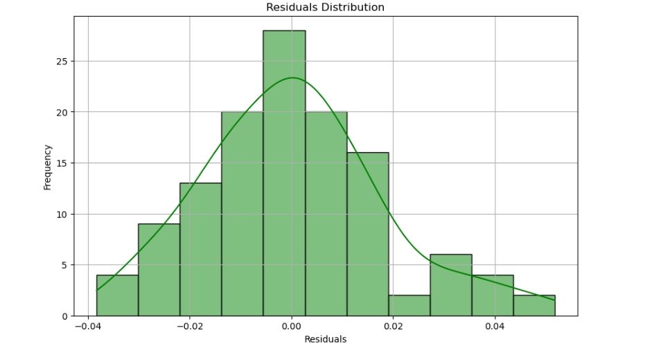

## Exploratory Data Analysis (EDA) For Model Performance

```python
# Plotting Actual vs Predicted values
plt.figure(figsize=(10, 6))
plt.scatter(y_test, y_pred, color='blue', alpha=0.6)
plt.plot([min(y_test), max(y_test)], [min(y_test), max(y_test)], color='red', lw=2)
plt.title('Actual vs Predicted CO₂ Storage Efficiency')
plt.xlabel('Actual CO₂ Storage Efficiency')
plt.ylabel('Predicted CO₂ Storage Efficiency')
plt.show()
```


---

## Plotting Residuals (Actual - Predicted)

```python
residuals = y_test - y_pred
plt.figure(figsize=(10, 6))
sns.histplot(residuals, kde=True, color='green')
plt.title('Residuals Distribution')
plt.xlabel('Residuals')
plt.ylabel('Frequency')
plt.show()
```



---

## Conclusion

The model achieves high accuracy in predicting CO₂ storage efficiency based on geological features (R-squared value = 0.9923, Mean Absolute Error = 0.0137). The model's effectiveness was visually evaluated using actual vs predicted CO₂ storage efficiency plots and residuals, which demonstrated the model’s capability to generalize well on unseen data. However, further improvements can be made by exploring more advanced models like Random Forest or Gradient Boosting.
