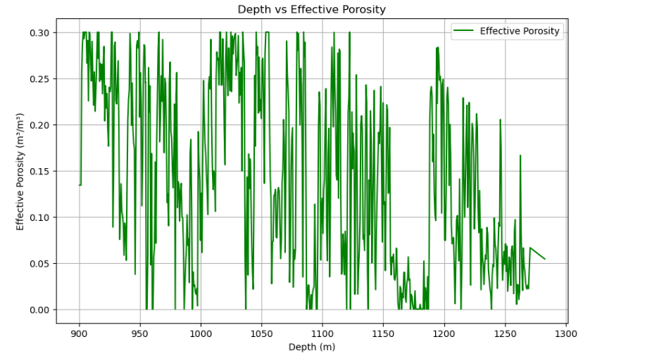
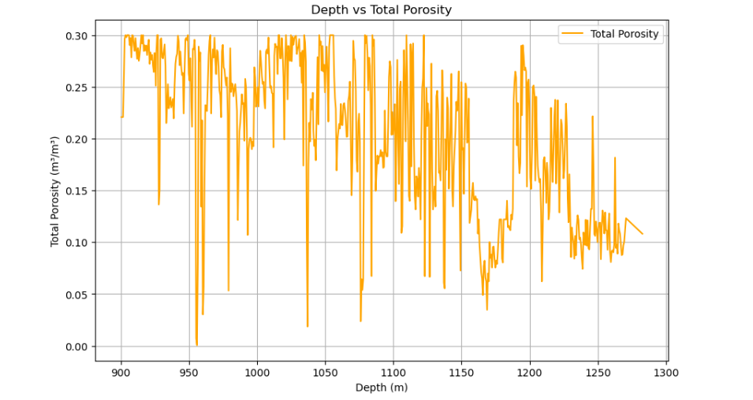
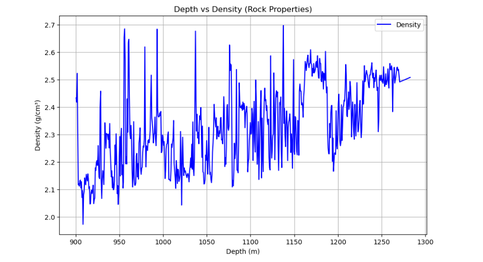

# Predicting CO₂ Storage Capacity: A Data-Driven Approach with Well Log Analysis

## Project Overview

This project aims to predict CO₂ storage capacity using geological data from well logs. The analysis focuses on understanding the relationship between geological features (e.g., porosity, density, and gamma ray) and CO₂ storage potential. The dataset used in this project comes from the Smeaheia well log data, a part of the larger CCS (Carbon Capture and Storage) initiative in Norway.

## Objective

The goal of this project is to predict the CO₂ storage efficiency using well log data, focusing on geological parameters such as **Effective Porosity**, **Density**, and **Gamma Ray**. The following steps were undertaken;

- Perform **Exploratory Data Analysis (EDA)** to understand well log data.
- Use **feature engineering** to create meaningful interaction features.
- Build a **predictive model** using machine learning techniques to estimate CO₂ storage capacity based on well log data.
- Evaluate the model’s performance using metrics such as **R-squared** and **Mean Absolute Error (MAE)**.

---

## Data

This project uses geological well log data from the **Smeaheia reservoir**. The dataset contains key geological features such as:

- **Effective Porosity**
- **Density**
- **Gamma Ray**
- **Depth**
  
These parameters are used to create features for predicting CO₂ storage efficiency.

**Data Access and Credits:**
- **Smeaheia Dataset**: This dataset was provided by **Equinor** under the [Smeaheia Dataset License](https://co2datashare.org/smeaheia-dataset/static/SMEAHEIA%20DATASET%20LICENSE_Gassnova%20and%20Equinor.pdf).

## Libraries Used

- `lasio`: To read and process well log data in LAS format.
- `pandas`: For data manipulation and preprocessing.
- `numpy`: For numerical operations.
- `matplotlib` and `seaborn`: For data visualization.
- `sklearn`: For machine learning, model training, and evaluation.

```python
import lasio
import pandas as pd
import numpy as np
import matplotlib.pyplot as plt
import seaborn as sns
from sklearn.linear_model import LinearRegression
from sklearn.model_selection import train_test_split
from sklearn.metrics import mean_absolute_error, r2_score
%matplotlib inline
```

## Data Preparation and Preprocessing

### 1. Load the Dataset

```python
# Load Dataset 
las = lasio.read(r"C:\Users\Joy\OneDrive\Ambiente de Trabalho\CO2_Storage_Analysis\data\Smeaheia 32 2-1 Well log data")

# Convert to DataFrame for easy manipulation
Smeaheia_Norway_Well_log_data = las.df()

# Display the first few rows to verify
Smeaheia_Norway_Well_log_data.head()
```

### 2. Selecting Relevant Parameters

```python
# Relevant parameter columns for analysis
Smeaheia_Norway_Well_log_data_columns = ['DEPTH:1', 'DEPTH:2', 'PHIE:1', 'PHIE:2', 'PHIT:1', 'PHIT:2',
                                        'DEN:1', 'DEN:2', 'DENC', 'GR:1', 'GR:2', 'GR:3', 'AI', 'RDEP:1',
                                        'RDEP:2', 'VSH']

# Select the relevant columns from the dataframe
Smeaheia_Norway_Well_log_data_columns_selected = Smeaheia_Norway_Well_log_data[Smeaheia_Norway_Well_log_data_columns]

# Display the first 100 rows of the selected data
Smeaheia_Norway_Well_log_data_columns_selected.head(700)
```

### 3. Data Cleaning

```python
# Check for duplicate rows
duplicates_rows = Smeaheia_Norway_Well_log_data_columns_selected.duplicated()
print(f"Number of duplicate rows: {duplicates_rows.sum()}")

# Drop duplicate rows
Smeaheia_Norway_Well_log_data_cleaned = Smeaheia_Norway_Well_log_data_columns_selected.drop_duplicates()

# Check for missing values in each column
missing_values_columns = Smeaheia_Norway_Well_log_data_cleaned.isnull().sum()
print(f"Missing values in each column:\n{missing_values_columns}")

# Rename columns for easier readability
Smeaheia_Norway_Well_log_data_cleaned.rename(columns={
    'DEPTH:1': 'Depth_1',
    'PHIE:1': 'Effective_Porosity',
    'PHIT:1': 'Total_Porosity',
    'DEN:1': 'Density_1',
    'DEN:2': 'Density_2',
    'DENC': 'Corrected_Density',
    'GR:1': 'Gamma_Ray_1',
    'GR:2': 'Gamma_Ray_2',
    'GR:3': 'Gamma_Ray_3',
    'AI': 'Acoustic_Impedance',
    'RDEP:1': 'Resistivity_1',
    'RDEP:2': 'Resistivity_2',
    'VSH': 'Shale_Volume'
}, inplace=True)
```

## Exploratory Data Analysis (EDA)

### 1. Data Visualization

#### Depth vs Gamma Ray (Shale vs Non-Shale)
```python
plt.figure(figsize=(10, 6))
plt.plot(Smeaheia_Norway_Well_log_data_cleaned['Depth_1'], 
         Smeaheia_Norway_Well_log_data_cleaned['Gamma_Ray_1'], 
         label='Gamma Ray', color='blue')
plt.xlabel('Depth (m)')
plt.ylabel('Gamma Ray (API)')
plt.title('Depth vs Gamma Ray (Shale vs Non-Shale)')
plt.legend()
plt.grid(True)
plt.show()
```


#### Depth vs Effective Porosity
```python
plt.figure(figsize=(10, 6))
plt.plot(Smeaheia_Norway_Well_log_data_cleaned['Depth_1'], 
         Smeaheia_Norway_Well_log_data_cleaned['Effective_Porosity'], 
         label='Effective Porosity', color='green')
plt.xlabel('Depth (m)')
plt.ylabel('Effective Porosity (m³/m³)')
plt.title('Depth vs Effective Porosity')
plt.legend()
plt.grid(True)
plt.show()
```



#### Depth vs Total Porosity
```python
plt.figure(figsize=(10, 6))
plt.plot(Smeaheia_Norway_Well_log_data_cleaned['Depth_1'], 
         Smeaheia_Norway_Well_log_data_cleaned['Total_Porosity'], 
         label='Total Porosity', color='orange')
plt.xlabel('Depth (m)')
plt.ylabel('Total Porosity (m³/m³)')
plt.title('Depth vs Total Porosity')
plt.legend()
plt.grid(True)
plt.show()
```



#### Depth vs Density (Rock Properties)
```python
plt.figure(figsize=(10, 6))
plt.plot(Smeaheia_Norway_Well_log_data_cleaned['Depth_1'], 
         Smeaheia_Norway_Well_log_data_cleaned['Density_1'], 
         label='Density', color='blue')
plt.xlabel('Depth (m)')
plt.ylabel('Density (g/cm³)')
plt.title('Depth vs Density (Rock Properties)')
plt.legend()
plt.grid(True)
plt.show()
```



### 2. Correlation Analysis
```python
corr_matrix = Smeaheia_Norway_Well_log_data_cleaned[['Depth_1', 'Effective_Porosity', 'Total_Porosity', 'Density_1', 'Density_2', 'Gamma_Ray_1', 'Resistivity_1']].corr()
plt.figure(figsize=(10, 6))
sns.heatmap(corr_matrix, annot=True, cmap='coolwarm', fmt='.2f', linewidths=0.5)
plt.title('Correlation Matrix: Geological Parameters')
plt.show()
```


## Feature Engineering

```python
# Creating interaction features
Smeaheia_Norway_Well_log_data_cleaned['Effective_Porosity_x_Depth'] = Smeaheia_Norway_Well_log_data_cleaned['Effective_Porosity'] * Smeaheia_Norway_Well_log_data_cleaned['Depth_1']
Smeaheia_Norway_Well_log_data_cleaned['Density_x_Depth'] = Smeaheia_Norway_Well_log_data_cleaned['Density_1'] * Smeaheia_Norway_Well_log_data_cleaned['Depth_1']
Smeaheia_Norway_Well_log_data_cleaned['Gamma_Ray_x_Porosity'] = Smeaheia_Norway_Well_log_data_cleaned['Gamma_Ray_1'] * Smeaheia_Norway_Well_log_data_cleaned['Effective_Porosity']
```

## Model Building and Evaluation

```python
# Define target parameter (CO₂_storage_efficiency)
Smeaheia_Norway_Well_log_data_cleaned['CO₂_storage_efficiency'] = (
    Smeaheia_Norway_Well_log_data_cleaned['Effective_Porosity'] * 
    Smeaheia_Norway_Well_log_data_cleaned['Density_1']
)

# Prepare data: Select input features and the target variable
X = Smeaheia_Norway_Well_log_data_cleaned[['Effective_Porosity_x_Depth', 
                                           'Density_x_Depth', 
                                           'Gamma_Ray_x_Porosity']]
y = Smeaheia_Norway_Well_log_data_cleaned['CO₂_storage_efficiency'] 

# Split data into training and test sets (80% training, 20% testing)
X_train, X_test, y_train, y_test = train_test_split(X, y, test_size=0.2, random_state=42)

# Scaling the features (standardization)
scaler = StandardScaler()
X_train_scaled = scaler.fit_transform(X_train)
X_test_scaled = scaler.transform(X_test)

# Initialize the Linear Regression model
model = LinearRegression()

# Fit the model to the training data
model.fit(X_train_scaled, y_train)

# Make predictions on the test set
y_pred = model.predict(X_test_scaled)

# Evaluate the model
r2 = r2_score(y_test, y_pred)
mae = mean_absolute_error(y_test, y_pred)

# Print the results
print(f"R-squared: {r2}")
print(f"Mean Absolute
```

---

## EDA for Model Performance

### Actual vs Predicted Plot

```python
plt.figure(figsize=(10, 6))
plt.scatter(y_test, y_pred, alpha=0.6)
plt.plot([y_test.min(), y_test.max()], [y_test.min(), y_test.max()], 'r--')
plt.xlabel('Actual')
plt.ylabel('Predicted')
plt.title('Actual vs Predicted CO₂ Storage Efficiency')
plt.grid(True)
plt.show()
```


### Residuals Plot

```python
residuals = y_test - y_pred
plt.figure(figsize=(10, 6))
sns.histplot(residuals, kde=True, color='green')
plt.title('Residuals Distribution')
plt.xlabel('Residuals')
plt.ylabel('Frequency')
plt.show()
```


---

## Conclusion

The model achieved **R² = 0.9923** and **MAE = 0.0137**, showing excellent performance in predicting CO₂ storage efficiency using geological well log features. The residuals distribution and actual vs predicted plots demonstrate a well-generalized model. Future work can explore non-linear models like **Random Forest** or **Gradient Boosting** for even better performance and robustness across reservoirs.

---

## Author

**Anuri Nwagbara**  
Reservoir & Process Engineering | CO₂ Storage | Python | CCS & Sustainability Projects

---

## License

This project is licensed under the terms of the dataset license provided by Equinor and Gassnova. See the [Smeaheia Dataset License](https://co2datashare.org/smeaheia-dataset/static/SMEAHEIA%20DATASET%20LICENSE_Gassnova%20and%20Equinor.pdf) for details.

---

## Dataset

**Smeaheia Reservoir Well Logs** – provided by [CO2DataShare](https://co2datashare.org/)
