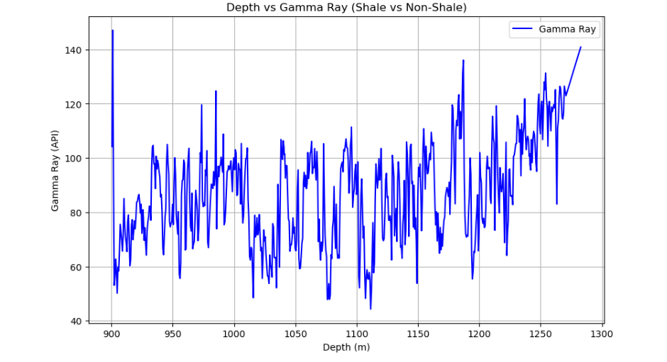
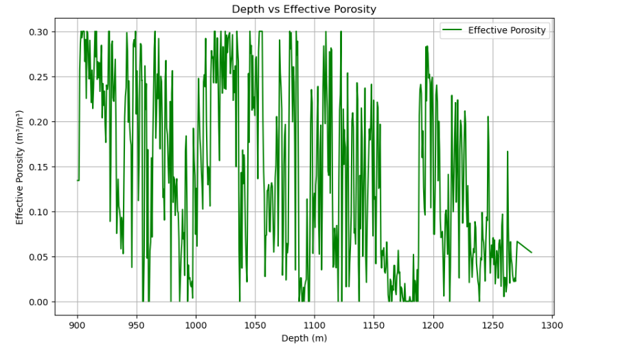
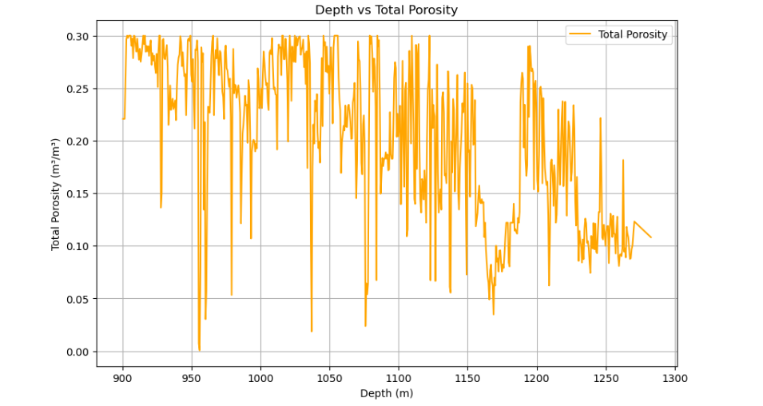
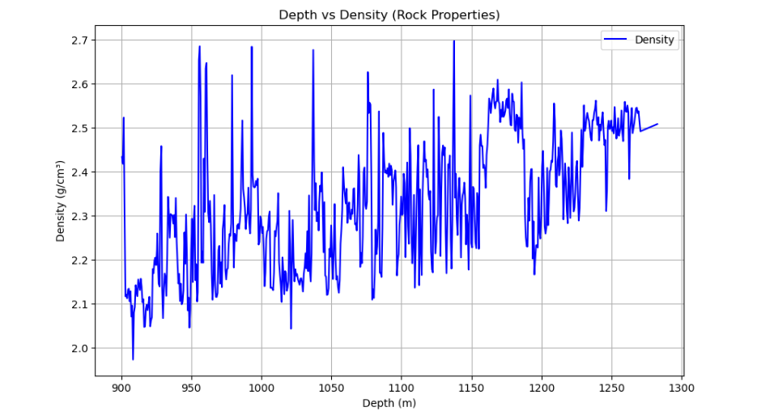
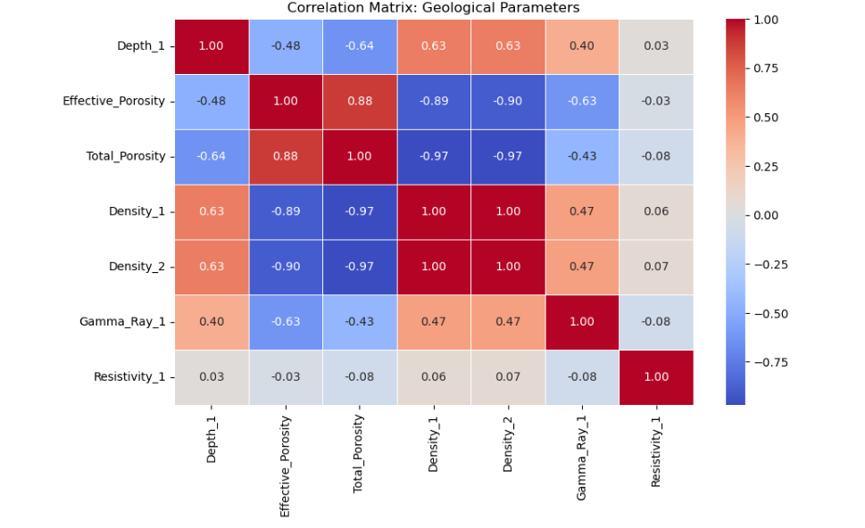
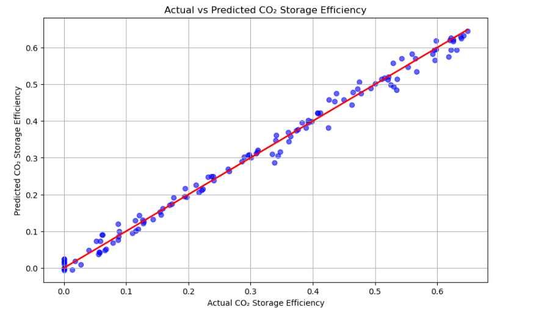
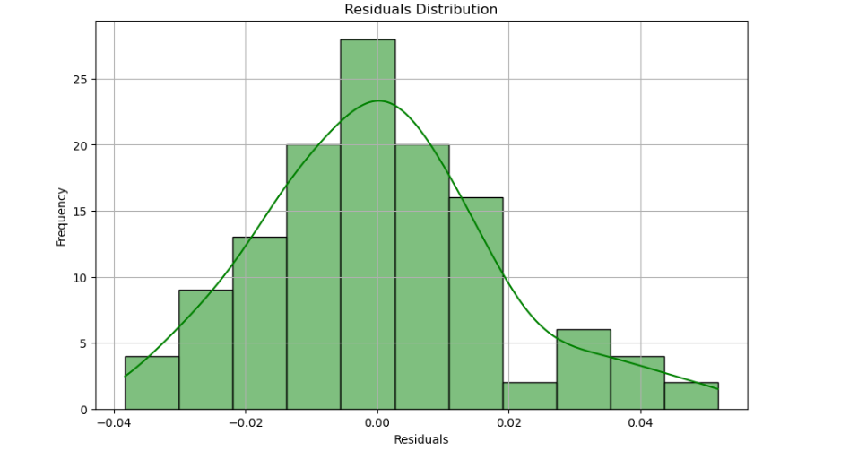

# Predicting CO₂ Storage Capacity: A Data-Driven Approach with Well Log Analysis

## Project Overview

This project aims to predict CO₂ storage capacity using geological data from well logs. The analysis focuses on understanding the relationship between geological features—such as porosity, density, and gamma ray readings—and CO₂ storage potential. The dataset used in this project is derived from the **Smeaheia well log data**, which is part of Norway’s larger CCS (Carbon Capture and Storage) initiative.

## Objective

The goal of this project is to estimate CO₂ storage efficiency by analyzing geological parameters such as:

- **Effective Porosity**
- **Density**
- **Gamma Ray**

The key steps include:

- Performing **Exploratory Data Analysis (EDA)**
- Applying **feature engineering** techniques
- Building and evaluating a **machine learning model**
- Interpreting performance using **R-squared** and **Mean Absolute Error (MAE)**

---

## Data

The project uses geological well log data from the **Smeaheia reservoir**, including features like:

- Depth
- Effective Porosity
- Density
- Gamma Ray

**Data Access & Credits**  
The dataset was provided by **Equinor** and is available under the [Smeaheia Dataset License](https://co2datashare.org/smeaheia-dataset/static/SMEAHEIA%20DATASET%20LICENSE_Gassnova%20and%20Equinor.pdf).

---

## Libraries Used

```python
import lasio
import pandas as pd
import numpy as np
import matplotlib.pyplot as plt
import seaborn as sns
from sklearn.linear_model import LinearRegression
from sklearn.model_selection import train_test_split
from sklearn.metrics import mean_absolute_error, r2_score
from sklearn.preprocessing import StandardScaler
%matplotlib inline
```

---

## Data Preparation and Preprocessing

### Load the Dataset

```python
las = lasio.read(r"path_to_data\Smeaheia 32 2-1 Well log data")
Smeaheia_Norway_Well_log_data = las.df()
Smeaheia_Norway_Well_log_data.head()
```

### Select Relevant Parameters

```python
columns = ['DEPTH:1', 'DEPTH:2', 'PHIE:1', 'PHIE:2', 'PHIT:1', 'PHIT:2',
           'DEN:1', 'DEN:2', 'DENC', 'GR:1', 'GR:2', 'GR:3', 'AI', 
           'RDEP:1', 'RDEP:2', 'VSH']

selected_data = Smeaheia_Norway_Well_log_data[columns]
selected_data.head(700)
```

### Clean and Rename

```python
cleaned_data = selected_data.drop_duplicates()
print(cleaned_data.isnull().sum())

cleaned_data.rename(columns={
    'DEPTH:1': 'Depth_1',
    'PHIE:1': 'Effective_Porosity',
    'PHIT:1': 'Total_Porosity',
    'DEN:1': 'Density_1',
    'DEN:2': 'Density_2',
    'DENC': 'Corrected_Density',
    'GR:1': 'Gamma_Ray_1',
    'GR:2': 'Gamma_Ray_2',
    'GR:3': 'Gamma_Ray_3',
    'AI': 'Acoustic_Impedance',
    'RDEP:1': 'Resistivity_1',
    'RDEP:2': 'Resistivity_2',
    'VSH': 'Shale_Volume'
}, inplace=True)
```

---

## Exploratory Data Analysis (EDA)

### Depth vs Gamma Ray

```python
plt.figure(figsize=(10, 6))
plt.plot(cleaned_data['Depth_1'], cleaned_data['Gamma_Ray_1'], color='blue')
plt.xlabel('Depth (m)')
plt.ylabel('Gamma Ray (API)')
plt.title('Depth vs Gamma Ray')
plt.grid(True)
plt.show()
```



### Other Key Plots

- **Depth vs Effective Porosity**  
  
- **Depth vs Total Porosity**  
  
- **Depth vs Density**  
  

### Correlation Matrix

```python
corr = cleaned_data[['Depth_1', 'Effective_Porosity', 'Total_Porosity', 
                     'Density_1', 'Density_2', 'Gamma_Ray_1', 'Resistivity_1']].corr()

plt.figure(figsize=(10, 6))
sns.heatmap(corr, annot=True, cmap='coolwarm', fmt='.2f')
plt.title('Correlation Matrix')
plt.show()
```



---

## Feature Engineering

```python
cleaned_data['Effective_Porosity_x_Depth'] = cleaned_data['Effective_Porosity'] * cleaned_data['Depth_1']
cleaned_data['Density_x_Depth'] = cleaned_data['Density_1'] * cleaned_data['Depth_1']
cleaned_data['Gamma_Ray_x_Porosity'] = cleaned_data['Gamma_Ray_1'] * cleaned_data['Effective_Porosity']
```

---

## Model Building and Evaluation

```python
cleaned_data['CO₂_storage_efficiency'] = cleaned_data['Effective_Porosity'] * cleaned_data['Density_1']

X = cleaned_data[['Effective_Porosity_x_Depth', 'Density_x_Depth', 'Gamma_Ray_x_Porosity']]
y = cleaned_data['CO₂_storage_efficiency']

X_train, X_test, y_train, y_test = train_test_split(X, y, test_size=0.2, random_state=42)

scaler = StandardScaler()
X_train_scaled = scaler.fit_transform(X_train)
X_test_scaled = scaler.transform(X_test)

model = LinearRegression()
model.fit(X_train_scaled, y_train)

y_pred = model.predict(X_test_scaled)

r2 = r2_score(y_test, y_pred)
mae = mean_absolute_error(y_test, y_pred)

print(f"R-squared: {r2}")
print(f"Mean Absolute Error: {mae}")
```

---

## EDA for Model Performance

### Actual vs Predicted Plot

```python
plt.figure(figsize=(10, 6))
plt.scatter(y_test, y_pred, alpha=0.6)
plt.plot([y_test.min(), y_test.max()], [y_test.min(), y_test.max()], 'r--')
plt.xlabel('Actual')
plt.ylabel('Predicted')
plt.title('Actual vs Predicted CO₂ Storage Efficiency')
plt.grid(True)
plt.show()
```



### Residuals Plot

```python
residuals = y_test - y_pred
plt.figure(figsize=(10, 6))
sns.histplot(residuals, kde=True, color='green')
plt.title('Residuals Distribution')
plt.xlabel('Residuals')
plt.ylabel('Frequency')
plt.show()
```



---

## Conclusion

The model achieved **R² = 0.9923** and **MAE = 0.0137**, showing excellent performance in predicting CO₂ storage efficiency using geological well log features. The residuals distribution and actual vs predicted plots demonstrate a well-generalized model. Future work can explore non-linear models like **Random Forest** or **Gradient Boosting** for even better performance and robustness across reservoirs.

---

## Author

**Anuri Nwagbara**  
Reservoir & Process Engineering | CO₂ Storage | Python | CCS & Sustainability Projects

---

## License

This project is licensed under the terms of the dataset license provided by Equinor and Gassnova. See the [Smeaheia Dataset License](https://co2datashare.org/smeaheia-dataset/static/SMEAHEIA%20DATASET%20LICENSE_Gassnova%20and%20Equinor.pdf) for details.

---

## Dataset

**Smeaheia Reservoir Well Logs** – provided by [CO2DataShare](https://co2datashare.org/)